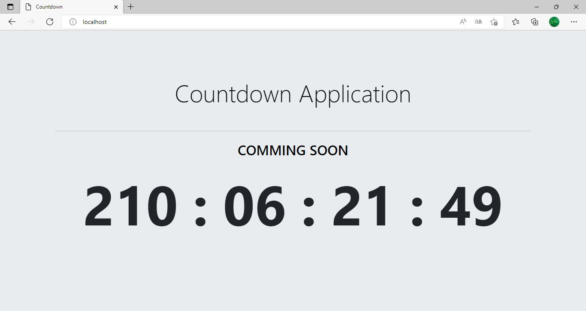

# Countdown

O projeto consiste num **container docker** que executa uma imagem **httpd** (gerada a partir de um **Dockerfile**) e através do **apache** exibe uma aplicação web desenvolvida em **html**, **css**, **bootstrap** e **javascript** que mostra um contador de contagem regressiva com base em uma data específica no futuro.

## Iniciar o Git no Repositório

```shell
users@DESKTOP MINGW64 ~/Documents/github-projects/countdown
$ git init
```

## Criação do Dockerfile

Criação do arquivo **Dockerfile** com a intrução para baixar a imagem oficial **httpd** no **Docker Hub** e copia o projeto para o container posteriormente.

```dockerfile
FROM httpd:latest
COPY ./src/ /usr/local/apache2/htdocs/
```

## HTML

Criação do arquivo **index.html**.

```html
<!DOCTYPE html>
<html lang="en">

<head>
    <meta charset="UTF-8">
    <meta http-equiv="X-UA-Compatible" content="IE=edge">
    <meta name="viewport" content="width=device-width, initial-scale=1.0">
    <title>Countdown</title>
    <link rel="stylesheet" href="./css/main.css">
    <link rel="stylesheet" href="./css/bootstrap.min.css">
</head>

<body class="bg-countdown">
    <header>
        <div class="container container-countdown">
            <h1 class="display-4 title-countdown">Countdown Application</h1>
            <hr class="my-4 hr-countdown">
            <h2 class="subtitle-countdown">COMMING SOON</h2>
            <div class="time-countdown">00 : 00 : 00 : 00</div>
        </div>
    </header>
    <script src="./js/main.js"></script>
</body>

</html>
```

## CSS

Criação do arquivo **main.css**.

```css
.bg-countdown {
    background-color: #e9ecef;
}

.title-countdown {
    color: black;
    text-align: center;
    padding-bottom: 2rem;
}

.subtitle-countdown {
    color: black;
    text-align: center;
}

.container-countdown {
    padding-top: 7rem;
}

.hr-countdown {
    background-color: #D6D6D6;
}

.time-countdown {
    font-size:8rem;
    font-weight: bold;
    text-align: center;
}
```

## JavaScript

Criação do arquivo **main.js**.

```js
//Configurar data final da contagem regressiva (getTime == Time in Milissegundos)
let launchDate = new Date("2023-01-01T00:00:00").getTime();

//Configurar temporizador para marcar a cada 1 segundo
let timer = setInterval(tick, 1000);

function tick() {
    let now = new Date().getTime();
    let t = launchDate - now;
    if (t > 0) {
        //Configurar dias, horas, minutos e segundos
        //Algoritmo de cálculo de dias
        let days = Math.floor(t / (1000 * 60 * 60 * 24));
        //Definir prefixo zero para qualquer número abaixo de 10
        if (days < 10) {
            days = "0" + days;
        }
        //Algoritmo de cálculo de horas
        let hours = Math.floor((t % (1000 * 60 * 60 * 24)) / (1000 * 60 * 60));
        if (hours < 10) {
            hours = "0" + hours;
        }
        //Algoritmo de cálculo de minutos
        let mins = Math.floor((t % (1000 * 60 * 60)) / (1000 * 60));
        if (mins < 10) {
            mins = "0" + mins;
        }
        //Algoritmo de cálculo de segundos
        let secs = Math.floor((t % (1000 * 60)) / 1000);
        if (secs < 10) {
            secs = "0" + secs;
        }
        //Criação da String de tempo
        let time = `${days} : ${hours} : ${mins} : ${secs}`;
        //Definir o tempo no documento
        document.querySelector('.time-countdown').innerText = time;
    }
}
```

## Construção da Imagem Docker

Criação da imagem docker a partir do arquivo **Dockerfile**.

```docker
users@DESKTOP MINGW64 ~/Documents/github-projects/countdown
$ docker build -t docker-countdown .
```

## Criação e Execução do Container

Criação e execução do container na porta 80 a partir da imagem **docker-countdown**.

```docker
users@DESKTOP MINGW64 ~/Documents/github-projects/countdown
$ docker run -d --name docker-httpd-countdown-webpage -p 80:80 docker-countdown
```

## Aplicação em Execução

Acessando a aplicação web em http://localhost/.

